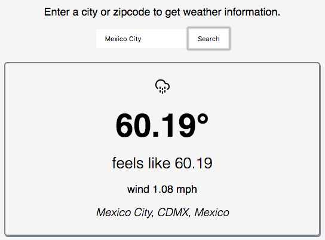

## Weather Info (React, Node, Express)

 
This app was bootstrapped with create-react-app.

### Setup
1. Clone and run `npm install`
2. Add your [Darksky](https://darksky.net/dev) and [Google Geocoding API](https://console.cloud.google.com/google/maps-apis/apis/geocoding-backend.googleapis.com) keys as env variables: `googleApiKey` and `darkSkyApiKey`
3. Run `npm start` to get the app up and running on http://localhost:3000/

### Server
Inside the `./server` directory is the NodeJS Express Api that takes the search data and resolves lat/long via Google, then calls Darksky for weather info.

### React App
All the React app code lives in `./src`. WeatherInfo is a "dumb" component with no state that is for rendering the weather info card and/or handling an error (bad location search for example). WeatherSearch has a state for the search location, which gets passed back up to App.
